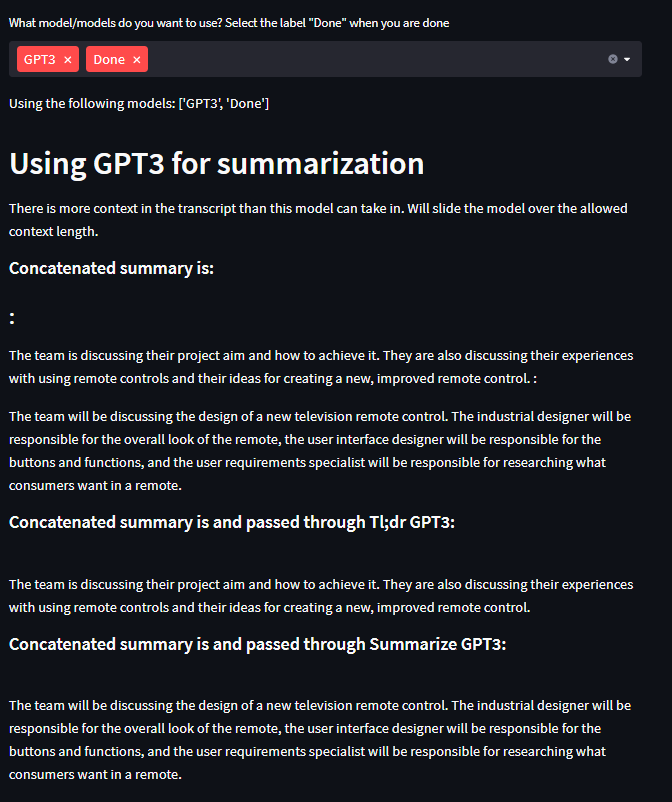

# Meeting Summaries

Welcome to **Meeting Summaries**, a streamlined solution to create concise and accurate summaries from your meetings. This tool leverages state-of-the-art Natural Language Processing models like BART and GPT to convert lengthy transcripts into clear and digestible summaries. This script can take inputs in the form of video, audio or text transcripts.

## 🚀 Getting Started

These instructions will guide you on how to install and run Meeting Summaries on your machine.

### Prerequisites

You must have Anaconda installed on your machine to use conda commands for environment setup. If not, please [install Anaconda](https://docs.anaconda.com/anaconda/install/) first.

### 🛠️ Environment Setup

The setup process varies depending on your system's GPU availability.

#### GPU Available (Recommended for Speed)

If your system has a GPU, use the `environment_gpu.yml` file to create the environment:

```shell
conda env create -f environment_gpu.yml
```
#### No GPU Available

If your system does not have a GPU, use the `environment.yml` file:

```
conda env create -f environment.yml
```
⚠️ Note: For modules like Diarization or if BART is used, running the code on a CPU can be significantly slow. Therefore, we highly recommend using a GPU.

## 🖥️ Running the Code

Before running the application, ensure that your Python environment can find the necessary imports with:
```shell
export PYTHONPATH=.
```

Then, you can run the application using:

```
streamlit run main.py
```

#### Additional Running Options

If you're running this on a server, use the following command:

```
streamlit run main.py --server.fileWatcherType none
```

To specify a server port, use the following command:

```
streamlit run main.py --server.fileWatcherType none --server.port 2084
```

#### OpenAI and Diarization Setup

For using GPT as your summarizer, you can add your OpenAI key in main.py or add it as an argument in the command line. Then, run:

```
streamlit run main.py -- --openai_key <your openai authentication key>
```

Follow steps in TL;DR section [here](https://huggingface.co/pyannote/speaker-diarization) to get access to the diarization model from hugging face if needed.

Add --diar_auth_key to the main command to use the diarization script:

```
streamlit run main.py -- --diar_auth_key <hugging face authentication key>
```

### 📄 Transcript Format

Please ensure that the transcript file contains utterances of each speaker on a new line. You can check out this [example](https://github.com/oncescuandreea/meeting_summaries/blob/0cba5f346e7780f1fb2df405856f656f90340787/data/AMICorpus/ES2008a.transcript.txt).

## 🚀 Supported Summarization Models
Currently, we support the following summarization models:

* BART
* GPT

We're also planning to incorporate other open source models in the future.

## 🖼️ Examples

Below are the summaries generated using BART and GPT models:

---------------
### Examples:


