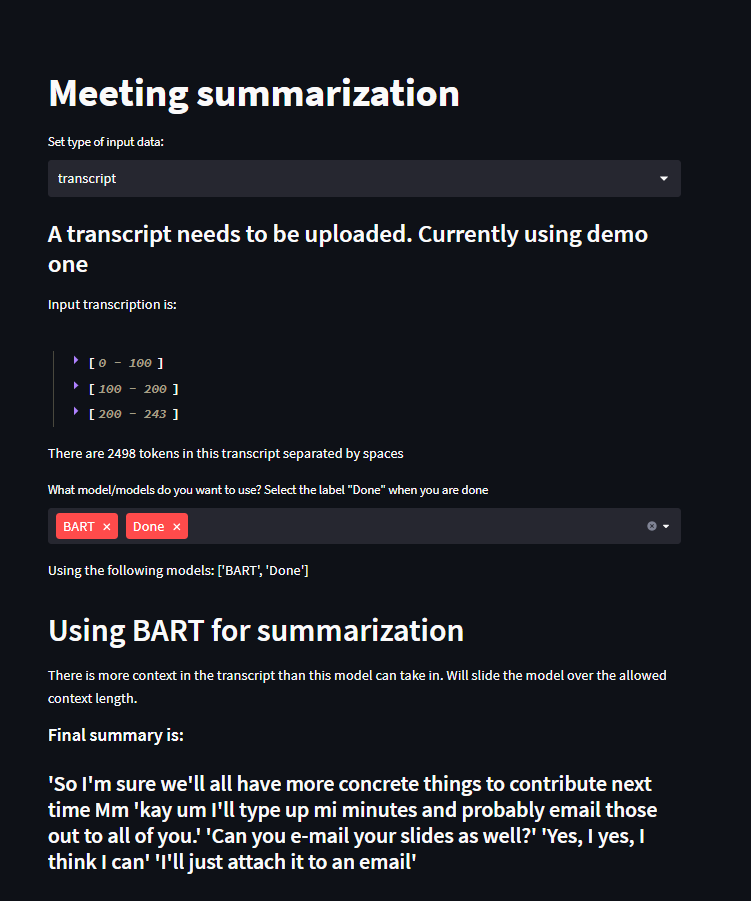

# meeting_summaries

To run this codebase without GPT or diarization, just run the following lines:
```
streamlit run main.py
```

Need to add in the main.py your own OpenAI token for this to work in case GPT is used for summarization. Then run:
```
streamlit run main.py --open_ai_key <your openai aauthentication key>
```

Can choose from BART and GPT currently to generate summaries.

Only inputting text has been tested.

Text file containing transcript needs to have the utterances of each speaker on a new line. One example is provided [here](https://github.com/oncescuandreea/meeting_summaries/blob/0cba5f346e7780f1fb2df405856f656f90340787/data/AMICorpus/ES2008a.transcript.txt)

Follow steps in TL;DR section [here](https://huggingface.co/pyannote/speaker-diarization) to get access to the diarization model from hugging face.

Add --diar_auth_key to the main command if you need to use the diarization script:
```
streamlit run main.py --diar_auth_key <hugging face authentication key>
```

---------------
### Examples:


